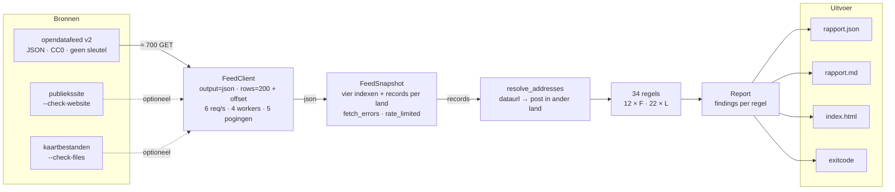
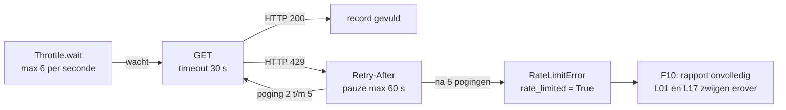
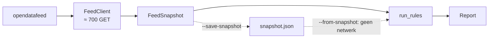

# Datastromen — van feed tot rapport

De validator neemt niets aan van een gebruiker. Alles wat er doorheen loopt
komt van publieke bronnen en eindigt in bestanden. Dit is wat er onderweg
gebeurt, zodat bij een melding meteen duidelijk is welke stap in beeld is.

Gestippeld is wat alleen draait met een vlag. Rechts van `Report` gaat alles
naar bestanden: er loopt geen enkele stroom terug naar de feed, en al helemaal
niet naar het CMS — dat is de afspraak uit [STRATEGY.md](../STRATEGY.md).

## 1. De feed in, een snapshot uit

Eerst vier index-endpoints, elk gepagineerd met `offset` omdat `rows` op 200
wordt afgekapt:

| Endpoint | Landt in |
| --- | --- |
| `infotypes/countries` | `snapshot.countries` |
| `infotypes/traveladvice` | `snapshot.traveladvice_index` |
| `infotypes/nl-representation` | `snapshot.representation_index` |
| `infotypes/hulp-bij-nood` | `snapshot.emergency_info` |

Daarna per land, vier threads tegelijk: het volledige reisadvies
(`countries/{land}/traveladvice`), de postenlijst
(`countries/{land}/nl-representation`) en per post nog een detailverzoek voor
adres, telefoon en e-mail. Vier index-aanroepen, plus per land één reisadvies,
één postenlijst en één verzoek per post — dat zijn de ruim 700 GET's van een
ronde.

Wat de regels daar uiteindelijk uit lezen is klein en concreet: `title`,
`introduction`, `contentblocks`, de kaarten onder `files` en `mapType`, de drie
datumvelden `modificationdate`, `lastmodified` en `issued`, en per post
`address`, `telephonenumbers`, `emailaddress` en `dataurl`.

### Wat er gebeurt als de gateway afknijpt

De onderste tak is waarom dit het tekenen waard is. Een afgeknepen verzoek zet
`rate_limited` op het land, en daardoor meldt F10 dat de ronde onvolledig is in
plaats van dat L01 een ontbrekend reisadvies rapporteert. Zonder dat
onderscheid ziet een te snelle ronde eruit als een kapotte feed — dat is precies
wat er in de [peiling van 14-09-2026](bevindingen-peiling-2026-09-14.md) gebeurde.

## 2. Twee optionele zijstromen

Met `--check-files` wordt elk kaartbestand daadwerkelijk opgehaald via zijn
`fileurl` — streamend, want de feed antwoordt niet op HEAD — en landen status,
mimetype en omvang in `map_checks`.

Met `--check-website` gaat er per land één verzoek naar de `canonical`-URL op
nederlandwereldwijd.nl. `website.py` haalt daar met drie reguliere expressies
"Laatst gewijzigd op", "Nog steeds geldig op" en de metatag `DCTERMS.issued`
uit. Dit is de enige stroom die de feed verlaat en een tweede host aanspreekt,
en daarmee de stroom die de vraag "ligt het aan de feed of aan de afnemer?"
beantwoordt.

## 3. Het snapshot heen en terug

Eén tak verdwijnt: bij `--from-snapshot` komt de JSON rechtstreeks bij
`run_rules` binnen en blijven de feed en de client — en daarmee alle 700
verzoeken — buiten beeld. `resolve_addresses` draait daarna alsnog, zodat een
oude peiling dezelfde uitkomst geeft als toen.

Wat bewaard wordt, moet ook terugkomen. `load_snapshot` leidt de velden daarom
af uit het dataclass in plaats van ze op te sommen: een opsomming raakt stil
achter. Dat gebeurde ook: `rate_limited` ontbrak erin, waardoor een bewaarde
peiling die was afgeknepen bij herdraaien niet meer meldde dat hij onvolledig
was.

## 4. Regels, rapport, publicatie

Voordat de regels draaien leidt `resolve_addresses` uit elke `dataurl` af welke
post zijn adres bij een ander land heeft staan — Amerikaans-Samoa wordt bediend
vanuit Wellington, en die link *is* het adres. Daarna vallen de landen uit
`--negeer-land` af en draaien twaalf feedregels (`F01`–`F12`) over het hele
snapshot en tweeëntwintig landregels (`L01`–`L22`) over elk overgebleven land.

Uit het `Report` komen vier dingen, en die gaan alle vier een andere kant op:

| Uitvoer | Inhoud | Bestemming |
| --- | --- | --- |
| `rapport.json` | elke regel en elke bevinding, machineleesbaar | CI leest hem terug om de run wel of niet te laten falen |
| `rapport.md` | samenvatting | `$GITHUB_STEP_SUMMARY` in het run-overzicht |
| `index.html` | rapport in Rijkshuisstijl | GitHub Pages, plus 90 dagen als artefact |
| exitcode | 0 of 1, geregeld door `--fail-on` | de status van de workflow |

Nog één uitgaande stroom, en die loopt niet vanaf de validator maar vanuit de
browser van de lezer: `index.html` verwijst naar het tokenpakket van de
Rijkshuisstijl Community op jsDelivr. Valt dat weg, dan valt het rapport terug
op een ingebouwde set tokenwaarden, zodat een artefact ook zonder netwerk
leesbaar blijft. Met `--no-theme-css` vervalt die stroom helemaal.

## Wat er niet stroomt

- **Geen koppeling met het CMS.** De validator kent alleen wat de feed
  publiceert; dat is de kern van de aanpak, niet een tekortkoming.
- **Geen invoer van gebruikers.** Alles komt binnen via de vlaggen op de
  commandoregel en de workflows.
- **Geen persoonsgegevens buiten wat al openbaar is.** Het enige wat op een
  persoon zou kunnen slaan zijn de contactgegevens van ambassades en
  consulaten, en die staan zo in de open feed.
